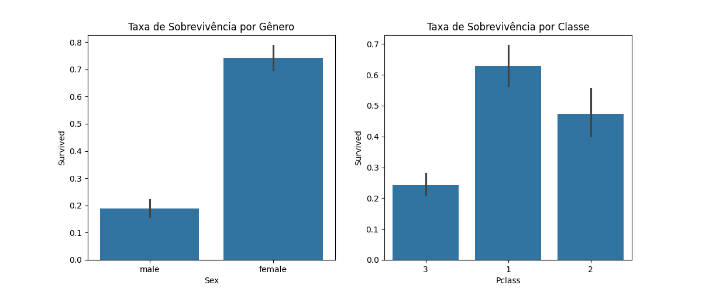
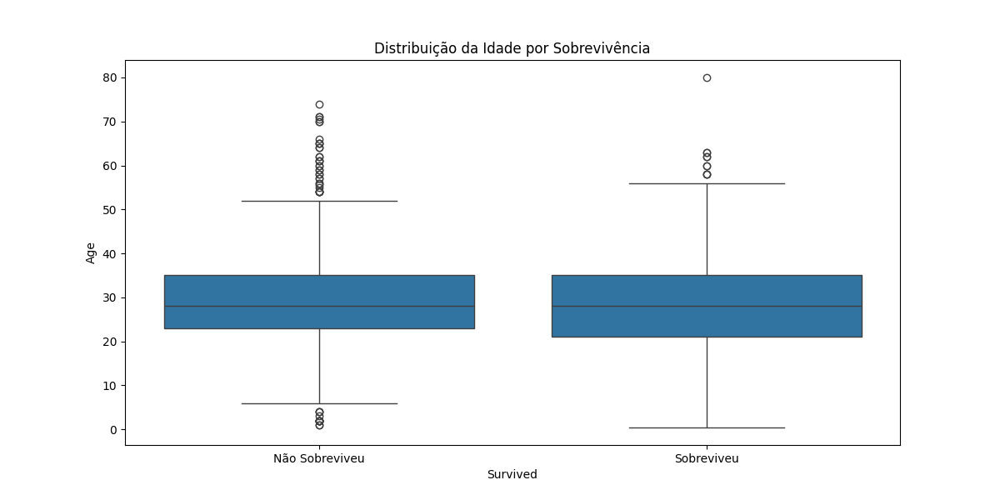
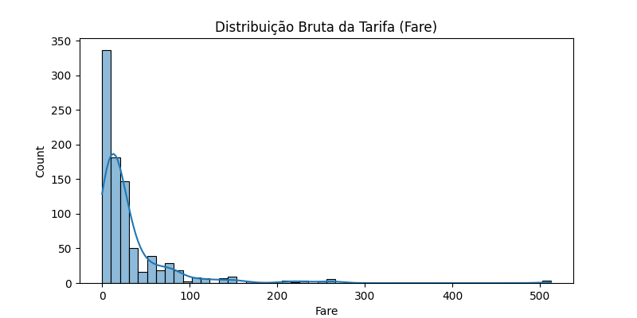

# 🚢 Projeto de Data Science: EDA Avançada e Pré-processamento - Dataset Titanic

## 1. Visão Geral do Projeto

Este projeto demonstra um pipeline de **Análise Exploratória de Dados (EDA)** avançada e **Pré-processamento** para o clássico *dataset* Titanic. O objetivo principal é transformar dados brutos e complexos em um formato pronto para modelagem preditiva, focando na superação de desafios comuns em Data Science, como valores ausentes (`NaN`), *outliers* e variáveis categóricas de alta cardinalidade.

### 🎯 Objetivo Principal

Prever a **Sobrevivência** (`Survived` - Variável Target Binária) dos passageiros, construindo *features* robustas baseadas em *insights* estatísticos e de negócio.

### 🛠️ Tecnologias e Ferramentas

| Categoria | Ferramenta | Uso no Projeto |
| :--- | :--- | :--- |
| **Linguagem** | **Python** | Linguagem de programação principal. |
| **Ambiente** | **VS Code & Jupyter Notebooks** | Fluxo de trabalho profissional e reprodutível. |
| **Manipulação** | **Pandas & NumPy** | Carregamento, limpeza e transformação de dados. |
| **Visualização** | **Seaborn & Matplotlib** | EDA para identificar distribuições, *outliers* e relações. |
| **Estatística** | **SciPy** | Testes estatísticos rápidos (assimetria, testes t, etc.). |
| **Controle de Versão**| **Git** | Rastreamento de alterações e colaboração (branch `main`). |

---

## 2. Análise Exploratória de Dados (EDA)

A EDA foi conduzida com foco em traduzir características complexas em *features* preditivas, utilizando o rigor estatístico.

### 2.1. Análise de Qualidade de Dados e Estatísticas Sumárias

A primeira etapa envolveu o uso de **`df.info()`** e **`df.describe(include='all')`** para quantificar a qualidade e a distribuição inicial dos dados.

| Coluna | Descoberta Estatística Chave | Implicações para o Pré-processamento |
| :--- | :--- | :--- |
| **`Survived`**| Taxa de sobrevivência geral de **38.4%** (`Média = 0.3838`). | Indica um desbalanceamento moderado de classes. |
| **`Age`** | **20% de valores ausentes** (714 de 891). Média (29.7) e Mediana (28.0) próximas. | Será imputada com a **Mediana**, pois é mais robusta a *outliers*. |
| **`Fare`** | **Forte assimetria à direita** (Média $32.20 vs. Mediana $14.45). Max é $512. | **Transformação logarítmica** será obrigatória para mitigar a assimetria e o impacto dos *outliers*. |
| **`Cabin`** | **77% de valores ausentes** (204 de 891). | A coluna bruta será transformada em uma *feature* **binária** (`Has_Cabin`). |
| **`Embarked`** | Apenas **2 valores ausentes**. | Imputação simples pela **Moda** (Porto mais frequente). |
| **`Pclass`** | **Mediana = 3.0**, confirmando que a 3ª classe era a mais populosa. | Confirma ser uma variável altamente preditiva (status social). 

### 💡 Insights Chave da EDA Visual

A análise gráfica das relações entre as variáveis confirmou as hipóteses iniciais e orientou a Engenharia de Features:

1.  **Status Social e Gênero:** A sobrevivência foi fortemente influenciada pela `Pclass` e `Sex`.
    
    

2.  **Idade e Outliers:** O Boxplot da Idade mostrou a distribuição em relação à sobrevivência.
    
    

3.  **Tarifa (Fare):** A alta assimetria na tarifa foi confirmada visualmente, o que justificou a transformação logarítmica.
    
    

---|

### 2.2. Engenharia de Features Chave (Feature Engineering)

Após a imputação de nulos (`Age` com Mediana, `Embarked` com Moda) e a transformação logarítmica de `Fare` (corrigindo a assimetria), as seguintes *features* preditivas foram criadas, gerando *insights* estatísticos robustos:

#### 💡 Resultados das Features Criadas

| Feature | Descrição | Taxa de Sobrevivência (Média) | Insight Chave |
| :--- | :--- | :--- | :--- |
| **`Has_Cabin` (1)**| Passageiro com cabine registrada | **66.67%** | Confirma que a posse de cabine é um poderoso preditor de status e sobrevivência (Taxa 2x maior que quem não tinha). |
| **`IsAlone` (0)** | Passageiro em grupo/família | **50.57%** | Passageiros que viajavam em grupo tiveram chance de sobrevivência significativamente maior do que os que viajavam sozinhos (30.35%). |
| **`Title` (Mrs)** | Título de Casada | **79.37%** | O `Title` provou ser o preditor mais forte, com `Mrs` e `Miss` apresentando as taxas mais altas. `Mr` (homem adulto) possui a taxa mais baixa (15.67%). |

---

## 3. Conclusões e Plano de Ação (Próximos Passos)

### 💡 Status das Fases

* ✅ **Imputação de Dados:** `Age` e `Embarked` foram tratados com sucesso.
* ✅ **Transformação de Dados:** `Fare` foi transformada via `log1p` para normalização.
* ✅ **Engenharia de Features:** `Has_Cabin`, `IsAlone`, `FamilySize` e `Title` foram criadas.

## 3. Conclusões e Plano de Ação (Próximos Passos)

### 💡 Status da Preparação de Dados

A fase de preparação de dados foi finalizada, garantindo que o dataset esteja 100% numérico e pronto para o treinamento de modelos.

### 📊 Codificação e Seleção Final de Features

| Ação | Resultado | Dimensões Finais |
| :--- | :--- | :--- |
| **One-Hot Encoding (OHE)** | Aplicado em `Sex`, `Embarked`, `Title` e `Pclass`. | +8 Novas colunas binárias criadas. |
| **Seleção Final** | Colunas originais redundantes (`Name`, `Ticket`, `Cabin`, `SibSp`, `Parch`, `Fare` original) removidas. | DataFrame final com **15 colunas** (`Survived` + 14 Features). |
| **Divisão (Train/Test)** | Dados divididos em 80% Treino e 20% Teste. | Treino (`X_train`): **712 linhas** (80%). |

## 4. Resultados Finais e Conclusão

A fase final do projeto consistiu no treinamento e avaliação de dois modelos de Classificação no conjunto de teste (20% dos dados).

### 🏆 Desempenho dos Modelos

| Modelo | Acurácia (Accuracy) | Precision (Classe 1 - Sobreviveu) | Recall (Classe 1 - Sobreviveu) |
| :--- | :--- | :--- | :--- |
| **Regressão Logística (Baseline)**| **0.8156 (81.56%)** | **0.79** | 0.71 |
| **Random Forest Classifier** | 0.8045 (80.45%) | 0.75 | **0.74** |

### Conclusão do Projeto

1.  **Regressão Logística como Modelo Final:** O modelo *Baseline* (Regressão Logística) demonstrou ser o mais eficiente, atingindo a **maior Acurácia geral (81.56%)** e a **maior Precisão (79%)** na previsão de sobrevivência. Isso indica que, quando o modelo prevê que um passageiro sobreviveu, ele está mais certo do que o Random Forest.
2.  **Importância do Pré-processamento:** O sucesso dos modelos, mesmo de um modelo linear simples como a Regressão Logística, demonstra a eficácia da **Engenharia de Features** (como `Title` e `Has_Cabin`) na transformação dos dados brutos em preditores robustos.
3.  **Sugestão de Continuidade:** Para tentar superar esta *baseline*, os próximos passos envolveriam **Otimização de Hiperparâmetros** (Grid Search ou Random Search) nos modelos, especialmente no Random Forest.

---

## 🔗 Estrutura do Repositório

ds_titanic_eda_python/ ├── venv/ # Ignorado pelo Git (Ambiente Virtual) ├── notebooks/ │ └── ds_titanic_eda.ipynb # Notebook principal com EDA e código de Feature Engineering ├── data/ │ └── Titanic-Dataset.csv ├── README.md # Este arquivo ├── requirements.txt # Lista de dependências └── .gitignore # Arquivo para exclusão de pastas (venv/) e arquivos de sistema